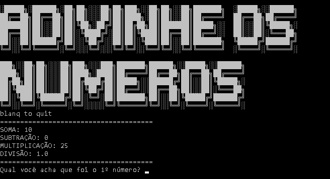

# Advinhe os Números
Jogo aonde o jogador tem que tentar adivinhar quais foram os números usados para atingir os resultados apresentados.

  

## Como Usar: 
Clone ou baixe este projeto para uma pasta. Depois disso, você pode executar o jogo pré-carregado:
game.py
